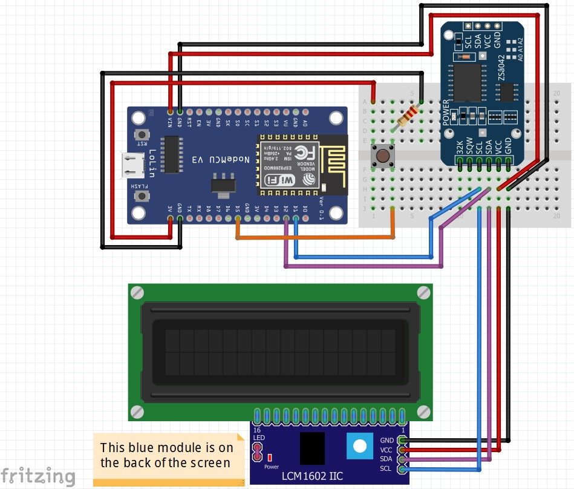

# Clock Makethon
> The code, installation instructions and schematics for the Clock Makethon

## Resources

- [Arduino](https://www.arduino.cc/) homepage
    > Arduino is an open-source electronics platform based on easy-to-use hardware and software. It's intended for anyone making interactive projects.
- [Arduino IDE](https://en.wikipedia.org/wiki/Arduino_IDE) on Wikipedia.
- [Arduino IDE](https://www.arduino.cc/en/Guide) getting started page.
- [NodeMCU](https://www.nodemcu.com/index_cn.html) (Node micro-controller unit) homepage
    > An open-source firmware and development kit that helps you to prototype your IOT product within a few Lua script lines 
- [NodeMCU](https://en.wikipedia.org/wiki/NodeMCU) on Wikipedia.
- [ESP8266](https://en.wikipedia.org/wiki/ESP8266) microchip on Wikipedia.

## Installation

### Install and set up Arduino IDE

The development board we are using for this project is a NodeMCU 8266 which is not a standard Arduino development board and thus, some additional installation is required.

1. Download the _Arduino IDE_ - go to the _Downloads_ section of the [Arduino software](https://www.arduino.cc/en/software) page and find your OS.
1. Install and open the IDE.
1. Configure the ESP8266 package URL.
    1. Go to the **Preferences** menu.
    1. Look for **Additional Boards Manager URLs**.
    1. Copy and paste the following URL. You don't need to open the URL.
        ```
        https://arduino.esp8266.com/stable/package_esp8266com_index.json
        ```
1. Install ESP8266.
    1. Open the **Tools** menu.
    1. Navigate to **Board > Boards Manager**
    1. Search for `esp8266`, which will show as _by ESP8266 Community_.
    1. Click the item and then click **Install**. 
    1. Close when done. 
1. Enable NodeMCU.
    1. Open the **Tools** menu.
    1. Navigate to **Board > ESP8266 Boards**.
    1. Select **NodeMCU 1.0**.

### Check if NodeMCU is detected

Make sure NodeMCU is not plugged in yet.

Then do the following to confirm it is detected.

1. Navigate to **Tools > Port** and count how many devices.
1. Now plug the NodeMCU device into your USB port.
1. Follow step 1 again to count devices. Verify that one extra device was detected.

If no new device was detected, please message me on Slack ASAP so we can debug it quickly.

### Download code and install libraries

This project requires a few libraries to be compiled:

1. Clone the code from this.
    ```sh
    $ git clone git@github.com:MorneL/Makeathon-Clock.git
    $ cd Makeathon-Clock
    ````
1. Open the [MakethonClock.ino](/MakethonClock/MakethonClock.ino) file.
1. Navigate to **Tools > Manage Libraries**.
1. Search for the following libraries (allow additional dependant libraries to be installed when prompted):
    * **RTClib** - by Adafruit.
    * **LCD_I2C** - by Blackhack (search for `lcd_i2c`).
    * **NTPClient** - by Fabrice Weinberg.
5. Look for the verify checkmark at the top left of the arduino window. Try to verify that all libraries have been installed successfully.

## Usage

### Compile and upload code to development board

TBC

### Assemble project
Schematics

